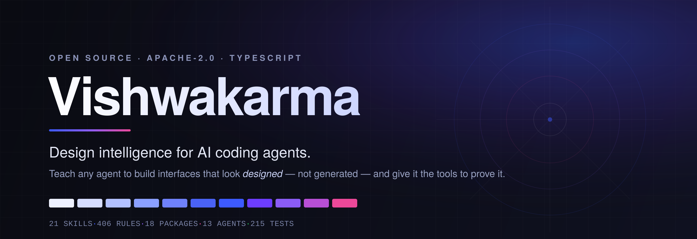

<div align="center">

<a href="#-why-this-exists">
  
</a>

<h1></h1>

[](LICENSE)
[](#-the-packages)
[](#-the-skill-catalog)
[](#-the-skill-catalog)
[](#)

**Teach any coding agent to build interfaces that look _designed_ — not _generated_ — and give it the tools to prove it.**

Works with **Claude Code · Cursor · Windsurf · Cline · Roo Code · Codex · Gemini CLI · Copilot · Continue · Zed · Aider** — and any MCP client.

```text
Install the skills from https://github.com/yogvidwankhede/vishwakarma
```

<sub>Open source · Apache-2.0 · TypeScript · Zero telemetry</sub>

</div>

---

## 💡 Why this exists

Ask any capable model to build a landing page and you'll get **the same page**, every time:

> Centred headline over three equal feature cards. A purple-to-blue gradient on the `<h1>`. One border radius and one drop shadow on everything. Grey-on-white body text that quietly fails the contrast check. No empty state, no loading state, and a layout that breaks the moment a real product name turns out to be longer than "Acme".

The page isn't *ugly*. Ugly would be interesting. It's **undifferentiated** — every element carries the same weight, so the eye has nowhere to go, and the result reads as competent and forgettable.

This isn't a capability gap. **Models know what good design looks like.** The problem is that *"make it look premium"* is not an instruction anything can act on — the model already believes that's what it produced.

> ### Adjectives don't survive contact with a language model.
> **So Vishwakarma doesn't use adjectives.**

---

## ✨ What it does instead

<table>
<tr>
<td width="50%" valign="top">

### 🎯 Names the exact failures
Not *"improve the hierarchy"* but *"a heading with equal space above and below it isn't bound to its own content — use 48px above, 12px below."*

</td>
<td width="50%" valign="top">

### 🔬 Explains mechanisms, not rules
Every rule carries the reasoning behind it — so an agent can **correctly override it** when the reasoning doesn't apply.

</td>
</tr>
<tr>
<td width="50%" valign="top">

### 🧮 Computes instead of guessing
Colour contrast is arithmetic. Perceptual ramps are arithmetic. Vishwakarma does the maths and hands back the answer.

</td>
<td width="50%" valign="top">

### ✅ Makes design checkable
The **Design Contract** turns "this could be better" into a test that passes or fails, with the exact fix attached.

</td>
</tr>
</table>

---

## 🚀 Quick start

### Paste the URL — Claude installs it

The fastest path. In any Claude Code session, just tell it where to look:

```text
Install the skills from https://github.com/yogvidwankhede/vishwakarma
```

Claude fetches the compiled catalog from `.claude/skills/` in the repository and copies all 34 skills into your project. No commands, no build, no npm.

### Claude Code plugin — two commands

The repository also ships as a **Claude Code plugin marketplace**, which gives you proper version management:

```text
/plugin marketplace add yogvidwankhede/vishwakarma
/plugin install vishwakarma@vishwakarma
```

All 34 skills load with progressive disclosure — descriptions always visible, full guidance and references only when relevant.

### Every other agent — the CLI

The CLI installs skills natively into **13 agent formats**. The packages aren't on npm yet (it's on the [roadmap](ROADMAP.md)), so run it from a checkout:

```bash
git clone https://github.com/yogvidwankhede/vishwakarma.git
cd vishwakarma
pnpm install && pnpm build
```

Then, from your own project directory:

```bash
# Detect your agents, install a starter skill set, and generate design tokens
node /path/to/vishwakarma/packages/cli/dist/index.js init

# Browse everything on offer
node /path/to/vishwakarma/packages/cli/dist/index.js list

# Install specific skills into specific agents
node /path/to/vishwakarma/packages/cli/dist/index.js add design-judgment motion-design --target claude-code cursor

# Register the MCP server — live tools with zero standing context cost
node /path/to/vishwakarma/packages/cli/dist/index.js add --target mcp
```

> **Tip:** inside the checkout, `pnpm vk <command>` is a shorthand for the same CLI. Once the packages are published, every command above becomes `npx vishwakarma <command>`.

`init` **reads your repo** to work out which agents and frameworks you use — so the first interaction is a *confirmation*, not a questionnaire.

Every writing command has a `--dry-run`, and anything written into a file *you* authored (like `AGENTS.md`) goes into a delimited section — so re-syncing **never** destroys your own instructions.

---

## 🧠 The magic: from a brief to a verified interface

When an agent with Vishwakarma installed is asked to *"build a pricing page"*, it now:

```
1. 🎲  Picks a design direction   — deterministically, so it doesn't collapse to the default
2. 📊  Ranks the content          — before styling anything
3. 📐  Structures the layout      — with real content, at realistic lengths
4. 🎨  Resolves every value       — to a design token, not a magic number
5. ♿  Composes accessibly        — native elements first, all states designed
6. 🎬  Choreographs motion        — only where it means something, reduced-motion aware
7. 🧪  Stress-tests               — long strings, empty lists, every viewport, keyboard
8. 🔍  Critiques itself           — the seven-pass protocol, and fixes what it finds
9. 📝  Reports                    — what it assumed, and what needs a human
```

And it can **verify its own work** instead of trusting its eyes:

```
check_contrast(foreground: "#8a8a8a", background: "#ffffff")

→ wcagRatio: 3.45  ·  passesAA: false
  suggestedForeground: "#777777"
  "Same hue and chroma, lightness nudged to the nearest value that passes —
   so it still reads as the same colour."
```

> The **fix** matters as much as the verdict. An agent told only *"this fails"* will guess a replacement — and usually guess wrong.

---

## 📚 The skill catalog

**34 skills**, carrying **534 rules** (every single one with its mechanism stated), **190 self-review checks**, and **136 deep references** loaded only when needed.

Two of those skills change how the rest behave. **Engineering Discipline** is always on: it governs how any task is approached — resolving ambiguity out loud, measuring before changing, restating work as something checkable, keeping diffs scoped. And the three **platform** skills are resolved *before* any value is chosen, because roughly half the constants in the catalog are mutually exclusive between platforms: 44pt is right on Apple and wrong on Android, 48dp is right on Android and not the Apple minimum, and a 46pt compromise is native to neither.

**Vishwakarma Studios** is the one skill that is not about interfaces. Games are real-time simulations with a deadline, and almost every wrong answer in them traces to a violated frame budget, a broken determinism contract, or a physically honest system that feels wrong because honesty was never the goal. It carries 68 of the catalog's references — engines, the fixed timestep, physics, game feel, netcode, game AI, production and shipping — and hands app UI back to the rest of the catalog.

| | | |
|---|---|---|
| 🎯 **Design Judgment** | 🏗️ **UI Generation Workflow** | 🔍 **Design Review** |
| ✍️ **Typographic Systems** | 🎨 **Colour Systems** | 🧱 **Layout & Composition** |
| 🌗 **Surface & Depth** | 📱 **Responsive Architecture** | 👆 **Interaction Design** |
| 🔄 **Interface States** | ♿ **Accessible Components** | 💬 **Interface Copy** |
| 🗺️ **Information Architecture** | 🎬 **Motion Design** | 📜 **Scroll Experiences** |
| ✨ **Micro-interactions** | 🧩 **Component Architecture** | 🎟️ **Design Tokens** |
| 🌓 **Theming Systems** | ⚡ **Rendering Performance** | 🔎 **SEO & Metadata** |
| 🎮 **Multiplayer Game Publishing** | 🧊 **3D Game Assets** | 🧭 **Engineering Discipline** |
| 🌐 **Web Platform** | 🤖 **Android Platform** | 🍎 **Apple Platform** |
| 🌀 **Motion Physics** | 📊 **Mobile Performance** | 🔬 **Accessibility Evidence** |
| 🧪 **Code Quality** | 🧬 **Reverse Engineering** | 🔌 **Public API Integration** |
| 🕹️ **Vishwakarma Studios** | | |

```bash
vishwakarma show motion-design   # read any skill in full
```

---

## 📦 The packages

**18 packages**, all building, all type-checked, all tested. A clean five-layer stack:

### 🧱 Foundation — *pure computation, zero dependencies*
| Package | What it does |
|---|---|
| [`@vishwakarma/core`](packages/core) | Perceptual colour (OKLCh), scales, the Motion Grammar, the Design Contract, the variation engine |
| [`@vishwakarma/tokens`](packages/tokens) | Three-tier token system → CSS, Tailwind v4, TypeScript, JSON, Markdown from one source |

### 🎨 Implementation — *working code that already embodies the guidance*
| Package | What it does |
|---|---|
| [`@vishwakarma/primitives`](packages/primitives) | Headless, accessible ARIA patterns — Dialog, Tabs, Menu, Disclosure — with full keyboard contracts |
| [`@vishwakarma/ui`](packages/ui) | 20 styled React 19 components on a typed variant system |
| [`@vishwakarma/layout`](packages/layout) | Intrinsic layout primitives — Stack, Grid, Bento, Cover, FullBleed & more |
| [`@vishwakarma/motion`](packages/motion) | Motion primitives with reduced-motion built in, and reveals that *can't hide your content* |
| [`@vishwakarma/scroll`](packages/scroll) | Scroll-driven animation first, observers second, never a measuring scroll handler |
| [`@vishwakarma/three`](packages/three) | React Three Fiber helpers that probe device capability before loading a single byte of WebGL |
| [`@vishwakarma/theme`](packages/theme) | Flash-free theme switching, three-state preference, density & forced-colors modes |
| [`@vishwakarma/tailwind`](packages/tailwind) | Tailwind v4 preset with custom utilities, variants & coverage warnings |

### 🛡️ Enforcement — *proves the guidance was followed*
| Package | What it does |
|---|---|
| [`@vishwakarma/audit`](packages/audit) | Extracts real measurements from source and checks them against the contract |
| [`@vishwakarma/lint`](packages/lint) | Lint rules for the design rules that are *genuinely* mechanical |
| [`@vishwakarma/testing`](packages/testing) | Matchers whose failure messages tell you the exact fix |

### 🚚 Distribution — *gets the intelligence into any agent*
| Package | What it does |
|---|---|
| [`@vishwakarma/skills`](packages/skills) | The skill format, validator & 34-skill catalog |
| [`@vishwakarma/adapters`](packages/adapters) | Compiles one skill into **13 agent formats**, with the install lockfile |
| [`@vishwakarma/mcp`](packages/mcp) | The MCP server — 14 tools, 2 prompts, 2 resources |
| [`@vishwakarma/registry`](packages/registry) | Copy-in component distribution with dependency resolution |
| [`@vishwakarma/cli`](packages/cli) | The installer, the profiler & the auditor's front end |

---

## 🆕 Nine ideas you won't find anywhere else

<details open>
<summary><b>1. The Design Contract</b> — design as a type system</summary>

<br>Expresses a design system as **machine-checkable constraints** rather than a document nobody reads. It says nothing about *what* a page contains — only what the grammar of the output must be, the same way a type system says nothing about what your function computes. It turns design review from an opinion into a test.
</details>

<details open>
<summary><b>2. The Motion Grammar</b> — timing derived from meaning</summary>

<br>A closed vocabulary of motion *intents* — `enter`, `exit`, `transform`, `respond`, `attract`, `occupy`, `affirm`, `reject` — from which duration and easing are **derived**. You're not choosing a duration; you're choosing what kind of event this is. *"This exit is using an entrance easing"* becomes a factual claim.
</details>

<details>
<summary><b>3. Compile-once, run-anywhere skills</b></summary>

<br>The skill format is a deliberate **superset** of the most constrained agent, so every adapter's job is subtraction, not invention. One source of truth → 13 native outputs → zero drift.
</details>

<details>
<summary><b>4. Evidence-carrying rules</b></summary>

<br>Every rule states its mechanism, its source, and its confidence — so an agent can *reason about* a rule rather than blindly obey it, and correctly override it when the mechanism doesn't apply.
</details>

<details>
<summary><b>5. Declared context budgets</b></summary>

<br>Skills declare their token cost, and the CLI **tells you what an install spends on every request**. A toolkit that quietly burns a fifth of the context window explaining animation to an agent writing a database migration has made it *worse*.
</details>

<details>
<summary><b>6. Non-destructive installation</b></summary>

<br>Your hand-written instructions live in a delimited section. Re-syncing rewrites only *our* region. Uninstalling removes it and leaves the rest — deleting the file only if nothing else remains.
</details>

<details>
<summary><b>7. Deterministic variation</b> — the cure for sameness 🎲</summary>

<br>Asked for a landing page, a model returns its *modal answer* every time — and that identical-ness across runs is exactly what makes generated work look generated. Telling it to "be creative" fails (an adjective); raising temperature trades sameness for incoherence. So the choice moves **out of the sampler and into the input**: a pre-vetted option set, selected by hashing the brief. Every outcome is defensible, the same brief always resolves the same way (reproducible & reviewable), and different briefs diverge. **720 combinations across 5 axes.**
</details>

<details>
<summary><b>8. An install lockfile that knows what you edited</b></summary>

<br>It separates four situations a naive tool collapses into one: *unchanged*, *updated*, *drifted* (you edited it), and *conflicting* (both moved). Only the last two ever interrupt you — because a tool that asks about every file trains people to click "yes" without reading.
</details>

<details>
<summary><b>9. A project profile</b></summary>

<br>`vishwakarma profile` records the tokens you already define, the components you already have, and how your dark theme is scoped — then writes it as Markdown an agent reads *before writing a line*. Deterministic and safe to commit, so a teammate's agent starts from the same understanding as yours.
</details>

---

## 🔌 Works with your agent

<div align="center">

| Agent | Where it installs |
|---|---|
| **Claude Code** | `.claude/skills/` |
| **Cursor** | `.cursor/rules/` |
| **Windsurf** | `.windsurf/rules/` |
| **Cline / Roo / Continue** | `.clinerules/` · `.roo/rules/` · `.continue/rules/` |
| **Codex / Gemini / Copilot** | `AGENTS.md` · `GEMINI.md` · `.github/copilot-instructions.md` |
| **Zed / Aider** | `.rules` · `CONVENTIONS.md` |
| **Any MCP client** | `.mcp.json` — *nothing loads until the agent asks* |

</div>

```bash
pnpm vk targets   # from the checkout — see every supported agent and where it lands
```

---

## 🛠️ Use the packages directly

The skills *teach*; the packages *implement*. Use either, or both.

```tsx
import { Reveal, RevealStyles } from '@vishwakarma/motion'
import { Stack, Container, Bento } from '@vishwakarma/layout'
import { Button, Card, EmptyState } from '@vishwakarma/ui'

export function Features({ items }) {
  return (
    <Container>
      <Stack gap="loose">
        {items.map((item) => (
          <Reveal key={item.id} from="below" distance="short">
            <Card>{item.title}</Card>
          </Reveal>
        ))}
      </Stack>
    </Container>
  )
}
```

> `RevealStyles` emits a tiny blocking script that *arms* the reveal. Without it, nothing breaks — elements simply appear un-animated. That's the correct failure mode, and the whole reason the mechanism works this way round.

---

## 🧪 Enforce it in CI

`@vishwakarma/audit` checks source against the Design Contract and speaks GitHub's annotation format natively:

```js
// scripts/design-audit.mjs
import { auditProject, formatReport } from '@vishwakarma/audit'
import { DEFAULT_CONTRACT } from '@vishwakarma/core'

const report = await auditProject(['src/**/*.{tsx,jsx,css}'], DEFAULT_CONTRACT)
console.log(formatReport(report, { format: 'github' }))
if (report.summary.errors > 0) process.exit(1)
```

```yaml
- run: node scripts/design-audit.mjs
```

Violations show up as **inline annotations** on the pull request. Errors fail the build; warnings don't. *(And it's honest about being a lower bound — static analysis can't resolve computed class names, and the report says so.)*

---

## 📖 Documentation

| | |
|---|---|
| 🚀 [Getting started](docs/getting-started.md) | Install, wire up tokens, everyday commands |
| 🏛️ [Architecture](docs/architecture.md) | How it fits together, and *why* |
| 🔌 [Agent integration](docs/agents.md) | Per-agent file locations & trade-offs |
| ✍️ [Authoring skills](docs/authoring-skills.md) | Write your own |
| 🗺️ [Roadmap](ROADMAP.md) | What's planned — and what's deliberately not |
| ⚖️ [Originality policy](ORIGINALITY.md) | How we keep the "original work" promise |
| 🤝 [Contributing](CONTRIBUTING.md) | Disagreement especially welcome |

---

## ⚖️ Licence, ownership & original work

Vishwakarma is **open source under the [Apache License 2.0](LICENSE)** — use it, build on it, ship it commercially. All it asks is that you keep the copyright and licence notices, and note any changes you make. Apache-2.0 also gives you an explicit patent grant, which plain MIT does not.

Every line of code, every skill, every token was **written from scratch** for this project — informed by studying prior art, then designing our own solutions. A principle isn't copyrightable; an expression of it is. We took the former and wrote the latter ourselves. Every source file carries a copyright + `SPDX` header, so each file stays self-identifying even if it's lifted out of context.

> **"Vishwakarma" is a trademark of the project owner.** The code is yours to fork and build on; the *name* is not. That's the standard split — Apache protects the code, the trademark protects the identity. See [ORIGINALITY.md](ORIGINALITY.md) for the full policy.

CI enforces originality: a dependency with a non-permissive licence fails the build, and a source file carrying a *foreign* copyright header fails the build.

**Zero telemetry. Zero network calls at runtime. No paid tier for any published feature.**

---

## 🙏 The name

**Vishwakarma** is the divine architect and craftsman in Indian tradition — the maker of forms, the patron of builders. The name was chosen for its meaning: *design, making, craft*. The project is secular and makes no religious claim.

---

<div align="center">

### Built to make one idea true:

**good design is a set of decisions — and decisions can be checked.**

⭐ **Star this repo** if you believe generated UI can be better than generic.

[Get started](docs/getting-started.md) · [Browse the skills](#-the-skill-catalog) · [Read the architecture](docs/architecture.md) · [Contribute](CONTRIBUTING.md)

**Apache-2.0 Licensed** · Made with care for people who care how things look *and* work.

</div>
