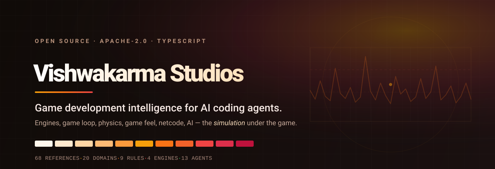

# Vishwakarma Studios



Most of this catalog is about interfaces. Vishwakarma Studios is about the thing underneath
one: the simulation. It is the skill that applies when the artefact is a game rather than an
app, and it exists as its own skill because game advice and software advice diverge at the
point where they are most confidently the same.

Games are real-time simulations with a deadline. A web application that takes 200ms to
respond is slow; a game that takes 200ms to respond is broken, because the player formed the
intent to act before their finger moved and is comparing your response against their own
memory of having already decided. Nearly every wrong answer in game development traces back
to one of three things: a violated frame budget, a broken determinism contract, or a
physically honest system that feels wrong because honesty was never the goal.

---

## The three load-bearing claims

**Feel outranks physical accuracy.** Coyote time, input buffering and asymmetric gravity are
lies the simulation tells, and they are correct. Nobody compares a jump against Newton; they
compare it against their intent. The failure mode is an engineer "fixing" a feel technique
into honesty and making the game worse, in a diff that reads like a bug fix.

**Determinism is a contract, not a preference.** It is free at the start and a rewrite later,
and whether you need it is decided by the design — replays, rollback, lockstep — not by
taste. A skill that does not force the question early lets the answer be chosen by accident.

**An unmeasured bottleneck is not a bottleneck.** Performance intuition in games is unusually
bad, because the cost is split across two processors, several threads, and a driver nobody on
the team wrote. The rule is not "profile first" as a platitude — it is that naming the wrong
system costs more than the delay of measuring would have.

---

## Scope, and the three siblings

Scope here is drawn against neighbouring skills rather than by subject, because "game" is not
a clean boundary — a game ships with menus, and a menu is app UI.

| Skill | Owns |
|---|---|
| `vishwakarma` | App UI, including launchers, settings screens, and store pages |
| `multiplayer-game-publishing` | The interface layer of a networked session |
| `3d-game-assets` | Generated meshes and their integration |
| `vishwakarma-studios` | The simulation underneath all three |

The netcode split is the one worth stating precisely. If the question is what the player is
shown while the network is slow, that is `multiplayer-game-publishing`. If it is what the
server believes and when, that is Studios.

---

## What it covers

Twenty domains, carried in 68 references that load only when their question is the agent's
question:

**Engines.** Unity, Unreal, Godot, and the custom path — the build-or-buy decision, a survey
of Bevy, love2d, raylib and MonoGame, and what you have to write yourself if you go that way.

**Simulation.** The fixed timestep and game loop, tick rate and determinism, ECS versus OOP
architecture, physics and collision.

**Presentation.** Animation systems, the rendering pipeline, audio.

**The player.** Game feel, input and controls, game UI and HUD, accessibility in games.

**Systems.** Netcode, game AI and navigation, design loops and progression.

**Shipping.** Performance and profiling, the production pipeline, shipping and live ops.

Each reference is held under a 6,000-token budget, which the skill validator enforces rather
than merely documents. The body carries nine rules — every one of them stating the mechanism
that makes it true, so an agent can override it correctly when the mechanism does not apply —
and a pre-ship review the agent runs against its own work.

---

## What it costs

```
Vishwakarma Studios    idle  39 tok    activated  2,947 tok
```

Thirty-nine tokens is the description, which is always in context so the agent can recognise
a game question when it sees one. The rest arrives only when it does, and the references
arrive only when a specific question makes one of them relevant. A skill this large is
affordable precisely because almost none of it is loaded almost all of the time.

---

## Install

Studios ships as part of the catalog. Both of the zero-setup paths install it along with
everything else:

```text
Install the skills from https://github.com/yogvidwankhede/vishwakarma
```

```text
/plugin marketplace add yogvidwankhede/vishwakarma
/plugin install vishwakarma@vishwakarma
```

There is no separate download for Studios alone, and no separate URL. If you want it on its
own — a game project has no use for `seo-and-metadata` — install it by id through the CLI
from a checkout (see [Getting started](getting-started.md#install) for the alias):

```bash
vishwakarma add vishwakarma-studios --target claude-code
vishwakarma add vishwakarma-studios --target claude-code cursor
```

Name the target. With no `--target`, the CLI installs for whatever it detects in the
current directory, and in a directory with no agent yet that resolves to the `universal`
`AGENTS.md` target — you get a 362-token summary rather than the skill and its 68
references.

It declares no dependencies, so that selection is genuinely one skill. Pair it with
`multiplayer-game-publishing` if the game is networked, `3d-game-assets` if meshes are being
generated, and the main `vishwakarma` skill for the menus and the settings screen.

---

## Asking for it

There is no invocation syntax. The activation intents are written as a player's or a
developer's phrasing of a problem rather than as a taxonomy, so the skill loads from an
ordinary description of what is wrong:

> The jump feels floaty and I do not know why.

> Physics behaves differently on the test machine than on mine.

> Enemies get stuck on doorways and the fight reads as unfair.

Each of those resolves to a diagnosis with a named mechanism rather than to a list of
suggestions.

---

## Where to go next

- [Getting started](getting-started.md) — install, tokens, and the MCP server
- [Agent integration](agents.md) — what each of the thirteen targets receives
- [Architecture](architecture.md) — tiering, budgets, and why references exist
